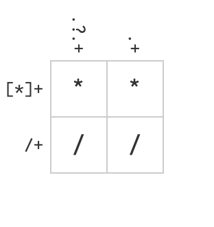

   
<details open>
  <summary>
Packages required
  </summary>  
     
-   [tidyverse](http://tidyverse.tidyverse.org/) (includes [ggplot2](http://ggplot2.tidyverse.org/), [dplyr](http://dplyr.tidyverse.org/), [tidyr](http://tidyr.tidyverse.org/), [readr](http://readr.tidyverse.org/), [tibble](http://tibble.tidyverse.org/))  
- [gapminder](https://cran.r-project.org/web/packages/gapminder/index.html)    
- [knitr](https://cran.r-project.org/web/packages/knitr/index.html)    
  
**Install by running**  
```
install.packages("packageName", dependencies = TRUE)
```
</details>  
   
   
```{r setupchunk, global_options, include=FALSE}
## Figure options
# fig.width=12, fig.height=8

knitr::opts_chunk$set(fig.path='figs/', warning=FALSE, message=FALSE)
```


```{r packagechunk, message=FALSE, include = FALSE, include = FALSE}

packages <- c("tidyverse", "testthat")

if (length(setdiff(packages, rownames(installed.packages()))) > 0) {
  install.packages(setdiff(packages, rownames(installed.packages())))  
}

library(tidyverse)
library(testthat)

```


```{r}
install_load_packages <- function() {
  
x <- scan(what = "character")  

if (length(setdiff(x, rownames(installed.packages()))) > 0) {
  install.packages(setdiff(x, rownames(installed.packages())), dependencies = TRUE)  
}

sapply(x, library, character.only = TRUE)
sessionInfo(package = x)

}
```


# Task 1: Character data

## Exercises 14.2.5

### Question 1

**In code that doesn't use stringr, you'll often see `paste()` and `paste0()`. What's the difference between the two functions?**

**`paste (..., sep = " ", collapse = NULL)`**   
**`paste0(..., collapse = NULL)`**      

Arguments  

...   	  - one or more R objects, to be converted to character vectors.  
sep   	  - a character string to separate the terms. Not NA_character_.  
collapse  - an optional character string to separate the results. Not NA_character_.  


**`str_c(..., sep = "", collapse = NULL)`**   

Arguments  

...	- One or more character vectors. Zero length arguments are removed.    
Short arguments are recycled to the length of the longest.   
Like most other R functions, missing values are "infectious": whenever a missing value is combined with another string the result will always be missing. Use str_replace_na() to convert NA to "NA"   
sep	- String to insert between input vectors.   
collapse	- Optional string used to combine input vectors into single string.   

Value    

If collapse = NULL (the default) a character vector with length equal to the longest input string. If collapse is non-NULL, a character vector of length 1.   

```{r}
## this adds whitespaces (sep = " ") between the strings by default
paste("arm","pit")

## This does not add spaces between the strings
paste0("arm","pit") 
```

![armpit][armpit]

`paste()` adds a space (by default) via the `sep = " "` argument. `paste0()` does not have the `sep =` argument built it.   

**What stringr function are they equivalent to?**

The `str_c()` from `stringr::` is the equavalent if the `base::` `paste0()` and `paste(..., sep = " ")`. 


```{r}
## This is the same as paste0("light", "saber")
str_c("light", "saber")

# paste("light", "saber", sep = " ")
str_c("half", "sister", sep = " ")
```

```{r}
# NA is coerced into character 
paste(c(NA, "BrO")) # Two vector example 
paste0("What kind of fish is made out of 2 sodium atoms - ", 2, NA) # One vector example

# The 'sep = "-" is ignored in the in paste0()
paste0("twenty", "two", sep = "-" ) 

# paste() uses the 'sep="-"` argument
paste("state", "of", "the", "art",  sep = "-" )

```

Example above shows that that when the argument is used in `paste0(..., sep ="")` it is ignored and the value of the argument is taken as an additional string to be concatenated, but not for the `paste()`. Both the `paste` and the `paste0` coerces `NA` into a character vector. The `str_c` differs from in the way where it does not coereces NA into strings and drops out the character vector to be concatenated.

[armpit]: https://i.chzbgr.com/full/5911451136/h60ACC25C/

### Question 2

**In your own words, describe the difference between the `sep` and `collapse` arguments to `str_c()`.**

```{r}

x <- c("moon")
y <- c("shine", "light")
z <- c("full", "moon")

# The 'sep=' does not work here, because a single argumnent 'c()' is passed
str_c ( z , sep = "____" ) 
str_c ( c("full", "moon") , sep = "____") # output same as above, does not work 

## For it to work use the 'collapse=' instead of 'sep='

str_c ( z , collapse = "_" )
str_c ( c("full", "moon" ), collapse = "_")

# Altenatively, this works because the strings are passed as individual arguments to the 'sep=' argument.
str_c ("full", "moon" , sep = "_" )

# However, not useful many arguments. would you do this 26 times for all the alphabets ?
str_c ("a", "b", "c", "e", "f", "h", "i", "j", "k", "l", "m" , sep = "_" )

## This would not work in using the collapse, just concatenates
str_c ("full", "moon" , collapse = "_" )

# More examples using vector recycling and switching sep and collapse separators
str_c(x ,y,  collapse = "_")
str_c(x, y, sep = " ", collapse = "_") # notice the two " " (whitespaces) and one "_"
str_c(x, y, sep = "_", collapse = " ") # notice the two "_" (underscore) and one " " (whitespace)


# This would not work 
# str_c (letters, sep = "___" )

# This is the best solution
# str_c (letters, collapse = "___" )

```

By default the `str_c()` concatenates separate vectors- it doesnt collapse elements of a vector. By using `c()` a multiple element vector is passed as a single argument to the `str_c()` function. In such casses using the `sep=` argument with a `c()` does not concatenates, it just returns the separe vector as it was originally. This is where the `collapse=` argument is useful.

The `collapse =` arguments works by concatenating elements of a **single** vector with multiple elements (ect.. that was passed using c() or assigned using the c(). The collapse arguments looks for multiple elemental vectors to be concatenated tupple wise.


### Question 3

**Use `str_length()` and `str_sub()` to extract the middle character from a string.**

`str_sub(string, start = 1L, end = -1L)`

```{r}
oddString <- "isOddString"  # assign odd character number to oddSring

str_length(oddString) # Counts the string length


# subset string start at the middle by diving length with 2, use ceeling to round off to celing value if there is a floating point value instead of interger value
str_sub(oddString, ceiling(str_length(oddString)/2), ceiling(str_length(oddString)/2))


# let's define a function to get the middle index of a string with odd number of characters
str_middle_odd <- function(i) {
  ceiling(str_length(i) / 2)
}

# extract the middle character of string_odd, which is u

str_sub(oddString, str_middle_odd(oddString), str_middle_odd(oddString))
```


**What will you do if the string has an even number of characters?**

We try to get the middle two characters if the number of characters in a string is an even number.

```{r}
evenString <- "isEvenString" # assign even character number to evenString

str_length(evenString)

str_middle_even <- function(i) {
  str_length(i) / 2
}

str_sub(evenString, ceiling(str_length(evenString)/2), ceiling(str_length(evenString)/2)+1)

# extract the middle character of string_odd, which is "nS"

str_sub(evenString, str_middle_even(evenString), str_middle_even(evenString)+ 1)

```

### Question 4

**What does `str_wrap()` do? When might you want to use it?**

According to `?str_wrap`, this function tries to wrap paragraph into multiple lines using an algorithm called "Knuth-Plass paragraph wrapping algorithm". An introduction of this algorithm can be found [here](https://www.ugrad.cs.ubc.ca/~cs490/2015W2/lectures/Knuth.pdf).

```{r}
# The Ultimate Hitchhiker's Guide by Douglas Adams


paragraphwrap <- "Far out in the uncharted backwaters of the unfashionable end of the western spiral arm of the Galaxy lies a small unregarded yellow sun.Orbiting this at a distance of roughly ninety-two million miles is an utterly insignificant little blue green planet whose ape-descended life forms are so amazingly primitive that they still think digital watches are a pretty neat idea. This planet has-or rather had-a problem, which was this: most of the people on it were unhappy for pretty much of the time. Many solutions were suggested for this problem, but most of these were largely concerned with the movements of small green pieces of paper, which is the movements of small green pieces of paper, which is odd because on the whole it wasn't the small green pieces of paper that were unhappy."


cat (paragraphwrap) # print it without wrapping


cat(str_wrap(paragraphwrap, width = 80, indent = 4)) # let's try to print it after wrapping, and seperate by new line
```

The length of characters in each line is kept at 80 and there is an `indent` and `exdent` argument.

### Question 5

**What does `str_trim()` do?**

`str_trim()` removes white spaces from starting and end of a starting.

```{r}
# create letters with 8 space indent 
spaces = str_wrap(letters, indent = 8)
spaces

# use str_trim() to delete all spaces at the beginning and the end of the string
removeSpaces <- str_trim(spaces)
removeSpaces
```


**What's the opposite of `str_trim()`?**

`str_pad()` is the opposite of `str_trim` to add whitespace or other characters under the `pad=` argument.

`str_pad(string, width, side = c("left", "right", "both"), pad = " ")`

Re-create letters with spaces using `str_pad()`

We try to pad `string_no_sapces` back to `string_with_spaces`. Notice that, we need to add two spaces both at the beginning and the end of the string, which means we need to make the width of the final string 4 characters more.

```{r}
# use white spaces as pad value with a width of 9 (character + 8 whitespaces to the left)
str_pad(letters, 9, side = c("left"), pad = " ")

# can even bad both sides
str_pad(letters, 9, side = c("both"), pad = " ")

# check if the pad both sides is trimmed back to its original state
all(str_pad(letters, 9, side = c("both"), pad = " ") %>% 
  str_trim() == letters) # equality check returns TRUE only if all 26 letters is evaluated TRUE


```

### Question 6

**Write a function that turns (e.g.) a vector `c("a", "b", "c")` into the string `a`, `b`, and `c`. Think carefully about what it should do if given a vector of length 0, 1, or 2.**

Assuming the final string is "a, b, and c", we make the following rules for the function:

- If the length of vector is 0, we return an empty string (""); 
- If the length of vector is 1, we return the string inside the vector (e.g., "a");
- If the length of vector is 2, we follow the same format as the length is 3 or above, which means we return, for example, "a, and b".

```{r}
# vector into a string
str_vec2str <- function(x) { 
  packages <- c("tidyverse") # specify package required for function
if (length(setdiff(packages, rownames(installed.packages()))) > 0) {
  install.packages(setdiff(packages, rownames(installed.packages())))  
} # if tidyverse are not installed install then load, if installed, load tidyverse
library(tidyverse) 
  
  if (length(x) == 0) {
    return("")
  } else if (length(x) == 1) {
    return(x[length(x)])
  } else {
    # evaluate length of vector, exclude last element, then collapse to a single string
    singleVecNolast <- str_c(x[-length(x)], collapse = ", ")
    # concatenate vector without last element with last element using `sep = "and"`
    vec2string <- str_c(singleVecNolast, x[length(x)], sep = ", and ")
    # return the final string
    return(vec2string)
  }
}
```

Use `testthat` to test function.

```{r eval = F}
# create four vectors to test
zerostr <- c()
onestr <- c("a")
twostr  <- c("a", "b")
threestr <- c ("a", "b", "c")


  # zerostr : vector length of 0 returns ""
  expect_equal(str_vec2str(zerostr), "")
  
  # onestr: vector length of 1 returns "a"
  expect_equal(str_vec2str(onestr), "a")
  
  # twostr: vector length of 2 returns "a, and b"
  expect_equal(str_vec2str(twostr), "a, and b")
  
  # threestr: vector length of 3 returns (a,b, and c)
  expect_equal(str_vec2str(threestr), "a, b, and c")

```

Check if all returns TRUE, No error is good.


## Exercises 14.3.1.1

### Question 1

**Explain why each of these strings don't match a `\`: `"\"`, `"\\"`, `"\\\"`.**

The `\` (blackslash) is an escape character in both `R` and `regex`. Backslash is used to start an escape sequence inside character constants. Escaping a character not in the following table is an error.

`\n`	newline  
`\r`	carriage return  
`\t`	tab   
`\b`	backspace   
`\a`	alert (bell)   
`\f`	form feed    
`\v`	vertical tab   
`\\`	backslash \    
`\'`	ASCII apostrophe '    
`\"`	ASCII quotation mark "    
`\``	ASCII grave accent (backtick) `    
`\nnn`	character with given octal code (1, 2 or 3 digits)    
`\xnn`	character with given hex code (1 or 2 hex digits)    
`\unnnn`	Unicode character with given code (1--4 hex digits)     
`\Unnnnnnnn`	Unicode character with given code (1--8 hex digits)     
     

   
 When the `"\"` is used in `R`, `R` takes precedence and assumes its a special character for ussages such as `\n` or `\t` until and unless another special character is followed then it becomes a literal puncuation character. In `regex` the `\` is also a special character along with 12 other special characters and these needs to be escaped with a `\` before using them for literal special characters.  


    
 `\` - is a special character in R, when used singly leads to an incomplete expression error, `Error: Incomplete expression: "\"` in `R` when is evaluated in code chunk or results in the continuation `+` character when its run on the console.
 
```{r eval = FALSE}
# viewing the output of `\` as an code chunk error or a continuation character when is run in console
cat("\") 
```
 
     
- `\\` is evaluated as an escape character followed by a backslash (`\`), this will be sent to the regular expression engine as a single back slash `\`. Remember that in regex the `\` is also a special character therefore the expression in incomplete in regex.    

```{r eval = FALSE}
# viewing the output of `\\`
cat("\\") # prints "\"
```

     
- `\\\` is evaluated as an escape character followed by a backslash (`\`), and then an escape again this will be sent to the regular expression engine as a single back slash `\`    

```{r eval = FALSE}
# viewing the output of `\` as an code chunk error or a continuation character when is run in console
cat("\\\")
```


### Question 2

**How would you match the sequence `"'\` ?**

To match the `"'\`, `R` function has to produce a string output of `"'\` and there are few ways to go about to match the string. As a notes single quotes need to be escaped by backslash in single-quoted strings `' ' '`, and double quotes in double-quoted strings `" " "`. In regex double quotes and single quotes are not special characters. To match the sequence `"'\`, we will use strings encaspsulated in double quotes, hence the double quotes need to be escaped in `R` like so `\"` but not in regex as mentioned. The single quotes are not affected so it can be passed as it is. The `\` are special characters in `R` and regex hence it needs to be passed to regex like this `\\`. To obtain that string `R` it needs to be escaped twice resulting in 4 backslashes `\\\\`. 

The string to match the sequence for the question is `"\"'\\\\"` or every character can be escaped as such `\"\'\\\\"`


```{r}

Q14.3.1.1.1 <- "\"'\\" # create and assign matching string
Q14.3.1.1.2 <- "hello\"'\\world" # create and assign matching string

cat (Q14.3.1.1.1) # check if the string prints the same as the question.


str_view(Q14.3.1.1.1, pattern = "\"'\\\\") # Match Q14.3.1.1.1
str_view(Q14.3.1.1.2, pattern = "\"\'\\\\") # Match Q14.3.1.1.2

```


### Question 3

**What patterns will the regular expression \..\..\.. match? How would you represent it as a string?**

The `\..\..\..` will match a 6 characters string, a fullstop followed by any character in three sucessions in a row such as `.a.n.y`. 

```{r}
Q14.3.1.1.3 <- ".a.n.y"


str_view(Q14.3.1.1.3, pattern = "\\..\\..\\..")
```

## Exercises 14.3.2.1

### Question 1

**How would you match the literal string `"$^$"`?**

The `$` and `^` are special characters in regex therefore the woould need to be escaped, therfore the output of `R` should be `\$\^\$` to the regex engine. The string for that evaluate should escape the backslashes. To match the string in the question `\\$\\^\\$` would be the pattern.

```{r}

Q14.3.2.1.1 <- "$^$"

cat ("\\$\\^\\$") # Test string output for regex \$\^\$

str_view(Q14.3.2.1.1, pattern = "\\$\\^\\$")
```

### Question 2

**Given the corpus of common words in `stringr::words`, create regular expressions that find all words that fulfilling the following requirements.**

**Words starting with "y".**

```{r}
# find words starting with "y" using the "^y"
str_view(words, pattern = "^y", match = TRUE) # Use match = TRUE to only show words that match
```


**Words ending with "x".**

```{r}
# find words end with "x" using the "x$"
str_view(words, pattern = "x$", match = TRUE) # Use match = TRUE to only show words that match
```

**Are exactly three letters long. (Don't cheat by using `str_length()`!).**

```{r}
# use the random sampling where to keep markdown shorter
str_view(sample(words, 50), pattern = "\\b...\\b", match = TRUE) # use the boundry before and after three any characters
```

**Requirement 4: have seven letters or more.**

```{r}
str_view(sample(words, 50),  pattern = "\\b.......", match = TRUE) # use one boundry to define seven letters and more

```


## Exercises 14.3.3.1

### Question 1

**Create regular expressions to find all words that start with a vowel.**

```{r}

# find words that start with a vowel
str_view(sample(words, 20), pattern = "^[aeiou]", match = TRUE) 
```

**Create regular expressions that only contain consonants. (Hint: thinking about matching "not"-vowels.)**

```{r}
# find words that without a vowel using the not "^" special character
str_view(words, pattern = "^aeiou", match = T)

```

There is no words without all the vowels

**Create regular expressions that only end with `ed`, but not with `eed`.**

```{r}
# find words that end with "ed" but not "eed"
str_view(words, pattern = "[^e]ed$", match = TRUE)
```

**Create regular expressions that only end with `ing` or `ise`.**

```{r}
# find words that end with "ing" or "ise"
str_view(words, pattern = "ing$|ise$", match = TRUE)
```
### Question 2

** Create regular expressions that the rule is empirically verified the rule "i" before "e" except after "c".**

The sentenece is rather confusing, this is what it means, check for words that have "ie", and without any "cie". When "c" present, instead look for "cei"

```{r}
str_subset(words, pattern = "[^c]ie|cei") # subset not "c", before ie", and "cei"
```


### Question 3

**Create regular expressions that the rule is empirically verified is "q" always followed by a "u"?**

To check if "q" is always followed by "u", we can check if having "q" not (^q) followed by "u" results in an output. We will also use the test that package to do an expect identical test.

```{r}
# is "q followed by not u" non elegant manual way

str_view(words, pattern = "q[^u]", match = T)

# is "q followed by not u" more systematic elegant method, 

test_that("if 'q' is always followed by a 'u'", {
 expect_failure(expect_identical(str_view(words, pattern = "[^u]", match = T), 
                                 str_view(words, pattern = "qu", match = T)))
})

# could have been done like below, but would produce error when knitting, this code chunk would fail

# expect_identical(str_view(words, pattern = "[^u]", match = T), str_view(words, pattern = "qu", match = T))
```

No messages is good message, the verdict is q always is followed by a u.

### Question 4

**Write a regular expression that matches a word if it's probably written in British English, not American English.**

Some words taken from ()[https://www.spellzone.com/pages/british-american.cfm]

```{r }
# copy pasted from a a table from the website above and it is in a weird format
britUSAwords <- c("cancelled
counsellor
equalled
fuelling
fuelled
grovelling
canceled
counselor
equaled
fueling
fueled
groveling")

# use str _split to split words into individual words 
britUSAwords <- str_split(britUSAwords[1], pattern = "\n") 


# british spelling has often "ll" followed by any character.
str_view(britUSAwords, pattern = ".+l{2}", match = TRUE)


```

### Question 5

**Create a regular expression that will match telephone numbers as commonly written in your country.**

The telephone numbers in Malaysia typically is like so:- "+60 (12) 110 0101". 

```{r}
# create some malaysia, canada, and singapore numbers to test
telNum <- c("+60 12 110 0101", "+1 778 8464 273", "+65  1110 0000")

# use a regex to detect telephone numbers in Canada
str_view(telNum, pattern = "\\+60 [1-9][1-9] [:digit:]{3} [:digit:]{4}")
```

## Exercises 14.3.4.1

### Question 1

**Describe the equivalents of `?`, `+`, `*` in {m,n} form.**

- `?` is `{0,1}`
- `+` is `{1,}`
- `*` is `{0,}`

### Question 2

**Describe in words what these regular expressions match: (read carefully to see if I'm using a regular expression or a string that defines a regular expression.)**

- `^.*$` - is a regex expression that matches any character at the start with any number of character till the end. It matches any chracter except a new line.
- "\\{.+\\}" - is a string and is evaluated and sent to regex as `\{.+\}`. This matches 1 or more number of any character(s)/word which has to be inside a literal `{}` curly braces as such `{movember}`.
- `\d{4}-\d{2}-\d{2}` is a regular expresion that matches a string looks like a date, like so`2018-11-10`, d is digit in regular expression
- `"\\\\{4}"` is a string that is sent to regex as `\\{4}`. Regex escapes the first and evaluated the second blackslash as a litreal `\`, because it is immidietly followed by {4} it does not need to be escaped matching string `\\\\`.

### Question 3

**Create regular expressions to find all words that start with three consonants.**

```{r}
# words start with three consonants
str_view(words, pattern = "^[^aeoiu]{3}", match = TRUE)
```

**Create regular expressions to find all words that have three or more vowels in a row.**

```{r}
# words that have three or more vowels in a row 
str_view(words, pattern = "[aeoiu]{3,}", match = TRUE)
```

**Create regular expressions to find all words that have two or more vowel-consonant pairs in a row.**

```{r}

# words that have two or more vowel-consonant pairs in a row
str_view(sample(words, 50), pattern = "([aeoui][^aeoiu]){2,}", match = TRUE)
```

### Question 4

**Solve the beginner regexp crosswords [here](https://regexcrossword.com/challenges/beginner).**

The following images are the results for the crosswords.


    
  
  
  
  

## Exercises 14.3.5.1

### Question 1

**Describe, in words, what these expressions will match:**

- `(.)\1\1` regex, matches single character repeated in three succesion such as  "g**ooo**gle".   
-  `"(.)(.)\\2\\1"` string expression, matches a two character direct palindromic repeat character such as "**noon**".   
-  `(..)\1` regex, matches bi-repeated (two characters repeats) such as "**coco**".   
-  `"(.).\\1.\\1"` string expression, matches five characters string with repeated group in 1st, 3rd and 5th position with any random character in 2nd and 4th place such as, "c**a**n**a**d**a**".   
- `"(.)(.)(.).*\\3\\2\\1"` string expression, matches a three character palidrome with the middle having any ammount of character (0 or more). Making it 3 three chracter direct and non direct palidromic string such as "reviver".   

### Question 2

**Construct regular expressions to match words that start and end with the same character.**

```{r}
# match words that start and end with the same character
str_view(words, pattern = "^(.).*\\1$", match = TRUE) 
```

**Construct regular expressions to match words that contain a repeated pair of letters (e.g. "church" contains "ch" repeated twice.)**

```{r}
# find words that contain a repeated pair of letters
str_view(words, pattern = "(..).*\\1", match = TRUE)
```

**Construct regular expressions to match words that contain one letter repeated in at least three places (e.g. "eleven" contains three "e"s.)**

```{r}
# match words that contain one letter repeated in at least three places
str_view(words, pattern = "(.).*\\1.*\\1", match = TRUE)
```

## Exercises 14.4.2

### Question 1

**For each of the following challenges, try solving it by using both a single regular expression, and a combination of multiple `str_detect()` calls.**

**Find all words that start or end with x.**

```{r}
# single regex find words that start or end with x
str_subset(words, pattern = "^x|x$")

#  multiple str_detect() calls

# positions start with x
startxde <- str_detect(words, pattern = "^x") # logical vector of words starting with x
# find positions end with x
endxde <- str_detect(words, pattern = "x$") # logical vector of words ending with x

# subset words using pipe
words %>% 
  `[`(startxde | endxde)

# altenatively 

words[endxde | startxde] # subsets the word vector with a logical vector for x at the start or end of a word.

all(str_subset(words, pattern = "^x|x$") == words[endxde | startxde]) # check if they are the same
```


**Find all words that start with a vowel and end with a consonant.**

```{r}

# single regex
str_subset(words, pattern = "^[aeiou].*[^aeiou]$")

# multiple str_detect() calls

startvowel <- str_detect(words, pattern = "^[aeiou]") # logical vector of start with consonants

endconsde <- str_detect(words, pattern = "[^aeiou]$")  # logical vector of end with consonants

# find subset that start or end with x
words %>% 
  `[`(startvowel & endconsde)

```
**Are there any words that contain at least one of each different vowel?**

using `str_detect()` multiple approach there seems no word with all the vowels.

```{r}

# multiple str_detect() calls

avowel <- str_detect(words, pattern = "[a]") # logical vector of start with vowel a
evowel <- str_detect(words, pattern = "[e]") # logical vector of start with vowel e
ivowel <- str_detect(words, pattern = "[i]") # logical vector of start with vowel i
ovowel <- str_detect(words, pattern = "[o]") # logical vector of start with vowel o
uvowel <- str_detect(words, pattern = "[u]") # logical vector of start with vowel u

words %>% 
  `[`(avowel & evowel & ivowel & ovowel & uvowel)


# fucntion to test vowel

# vowels_test <- function(v) {
#   vowel <- c("a", "e", "i", "o", "u") #  vowels in vector vowel
#   for (vowel in vowels) { # loop over each vowels
#     check <- as.logical(seq_along(v)) & str_detect(v, pattern = vowel)
#   }
#   # return whether s contain at least one of each different vowel
#   return(v[as.logical(seq_along(v))])
# }
# 
# 
# 
# 
# # create a test case
# test_that("function contain_each_vowel() not works", {
#   test_string <- "aberixowu"
#   
#   expect_equal(test_string, vowels_test(test_string))
# })

```

### Question 2

**What word has the highest number of vowels?**

```{r}

# find the words with the highest number of vowels
words %>% 
  `[`(which(str_count(words, pattern = "[aeiou]")  == # count the number of vowels
              max(str_count(words, pattern = "[aeiou]"))))  # eval expression max and subset using which

```


**What word has the highest proportion of vowels? (Hint: what is the denominator?)**

```{r}
# find the words with the highest number of vowels
stringr::words %>% 
  `[`(which(str_count(words, pattern = "[aeiou]") # proportion of vowels in words
            / str_length(words) == max(str_count(words, pattern = "[aeiou]") / str_length(words))))
```

`a` should have the highest proportion considering it is purely a vowel word.

## Exercises 14.4.3.1

### Question 1

**In the previous example, you might have noticed that the regular expression matched "flickered", which is not a colour. Modify the regex to fix the problem.**


```{r}

colours <- c("red", "orange", "yellow", "green", "blue", "purple") # character vector of colors


(colour_match <- str_c(colours, collapse = "|")) # colapse into single vector, so regex "|" or operator

more <- sentences[str_count(sentences, colour_match) > 1]
str_view_all(more, colour_match)


(flickred <- str_c("\\b", colour_match, "\\b")) # boundry word matches \b to regex

# view sentences with more than 1 match
more <- sentences[str_count(sentences, flickred) > 1]
str_view_all(more, flickred)
```

U